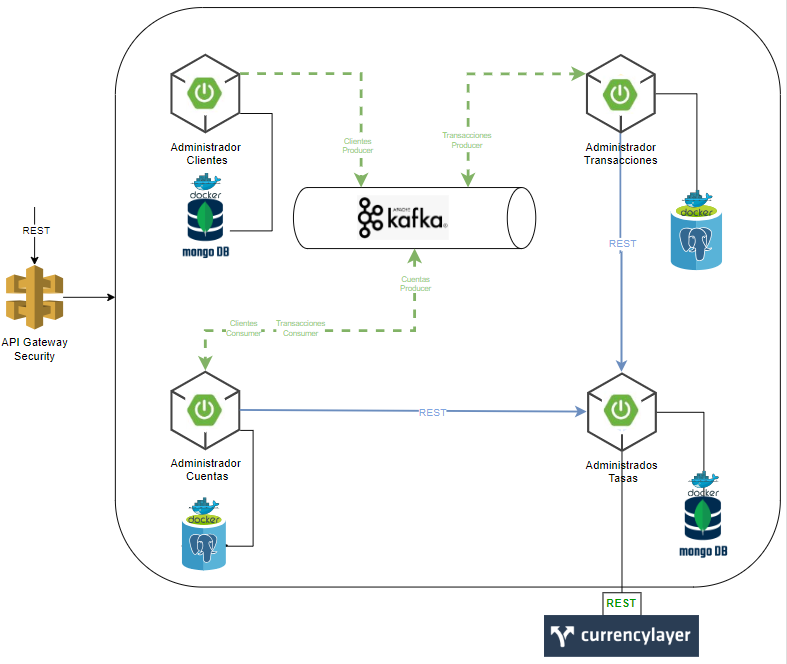

# Cajero Automático Multi Moneda

Este es un proyecto para un reto práctico de LMS que simula un cajero automatico multimoneda implementando con
microservicios en java con docker

### Stack Tecnológico

* Java 11
* SpringBoot 2.7.7
* Maven 3.9.4
* Openapi: 3.0.1
* Postgres 12
* MongoDB 6.0.12
* Zookeeper 3.9.1
* Kafka 3.4.1

### Patron de diseño

Para el proceso de implementación se considero los siguientes patrones de diseño:

1. **Delegate**: Para la implementación de apis REST generadas con openapi
2. **Facade**: Para a implementación de Repositorios de Datos

### Documentación

#### Documentación de Apis

Se implementó el proceso de documentación median openapi, cada microservicio tiene su documentación las siguientes
rutas:

1. [Api Tasas](./tasas/src/main/resources/docs/tasas.yaml)
2. [Api Clientes](./clientes/src/main/resources/docs/clientes.yaml)
3. [Api Cuentas](./cuentas/src/main/resources/docs/cuentas.yaml)
4. [Api Transacciones](./transacciones/src/main/resources/docs/transacciones.yaml)

#### Documentación Técnica

La documentación de la propuesta técnica de arquitectura se encuentra en [Propuesta Técnica](./docs/Propuesta_Tecnica.md)
_**Nota**: Considerar que la implementación al ser un primer MPV no contempla la funcionalidad de toda la arquitectura descrita_ 

La implementación de este proyecto contempla la siguiente estructura de despliegue:



### Contenedores

Para construir el contenedor, se debe ejecutar el archivo docker-compose del directorio principal con el siguiente
comando:

```bash
docker-compose up -d
```

La primera vez, es probable que demore un par de minutos, porque necesitará descargar las imágenes de los contenedores

Para comprobar que los contenedores se levantaron correctamente con el comando

```bash
docker ps -a
```

Se debe verificar que tengan el siguiente listado de contenedores en estado running:

1. clientes-database
2. zookeeper
3. kafka
4. cuentas-database
5. transacciones-database
6. tasas-database
7. clientes-app
8. cuentas-app
9. transacciones-app
10. tasas-app

```bash
docker ps -a
```

### Probar los servicios

Se creó una colección de postman que le permite probar los servicios de manera integral, el archivo se encuentra el
archivo se encuentra en [Test de Integración](docs/test/Cajero%20Multimoneda.postman_collection.json)

También prueba probar los servicios de manera individual siguiendo las siguientes instrucciones:

#### Crear cliente

El microservicio de clientes se estara ejecutando en la siguiente ruta: http://localhost:8000
La documentación de las apis se puede consultar mediante http://localhost:8000/swagger-ui/index.html

````http request
POST http://localhost:8001/clientes/crear
````

````json
{
  "ci": "6517731",
  "email": "lovandov@gmail.com",
  "nombre": "Lizeth",
  "apellido": "Ovando",
  "telefono": 78895651
}
````

#### Crear cuenta

El microservicio de cuentas se estara ejecutando en la siguiente ruta: http://localhost:8001
La documentación de las apis se puede consultar mediante http://localhost:8001/swagger-ui/index.html

````http request
POST http://localhost:8001/cuentas/crear
````

````json
{
  "clienteID": "065a6905-1412-4c7a-bc45-d22e00a59300",
  "moneda": "BOB",
  "saldo": 0
}
````

#### Consultar saldo

El microservicio de cuentas se estara ejecutando en la siguiente ruta: http://localhost:8001
La documentación de las apis se puede consultar mediante http://localhost:8001/swagger-ui/index.html

````http request
GET http://localhost:8001/cuentas/065a6905-1412-4c7a-bc45-d22e00a59300
````

#### Realizar Retiro

El microservicio de transacciones se estara ejecutando en la siguiente ruta: http://localhost:8002
La documentación de las apis se puede consultar mediante http://localhost:8002/swagger-ui/index.html

````http request
POST http://localhost:8002/transacciones/retiro
````

````json
{
  "cuentaID": "3fa85f64-5717-4562-b3fc-2c963f66afa6",
  "monto": 0.0001,
  "moneda": "BOB"
}
````

#### Realizar Depósito

El microservicio de transacciones se estará ejecutando en la siguiente ruta: http://localhost:8002
La documentación de las apis se puede consultar mediante http://localhost:8002/swagger-ui/index.html

````http request
POST http://localhost:8002/transacciones/deposito
````

````json
{
  "cuentaID": "3fa85f64-5717-4562-b3fc-2c963f66afa6",
  "monto": 0.0001,
  "moneda": "BOB"
}
````

### Para levantar de manera local

Siga las instrucciones de los archivos README.md de cada uno de los proyectos en el siguiente orden:

1. [tasas](tasas/README.md)
2. [clientes](clientes/README.md)
3. [cuentas](cuentas/README.md)
4. [transacciones](transacciones/README.md)
