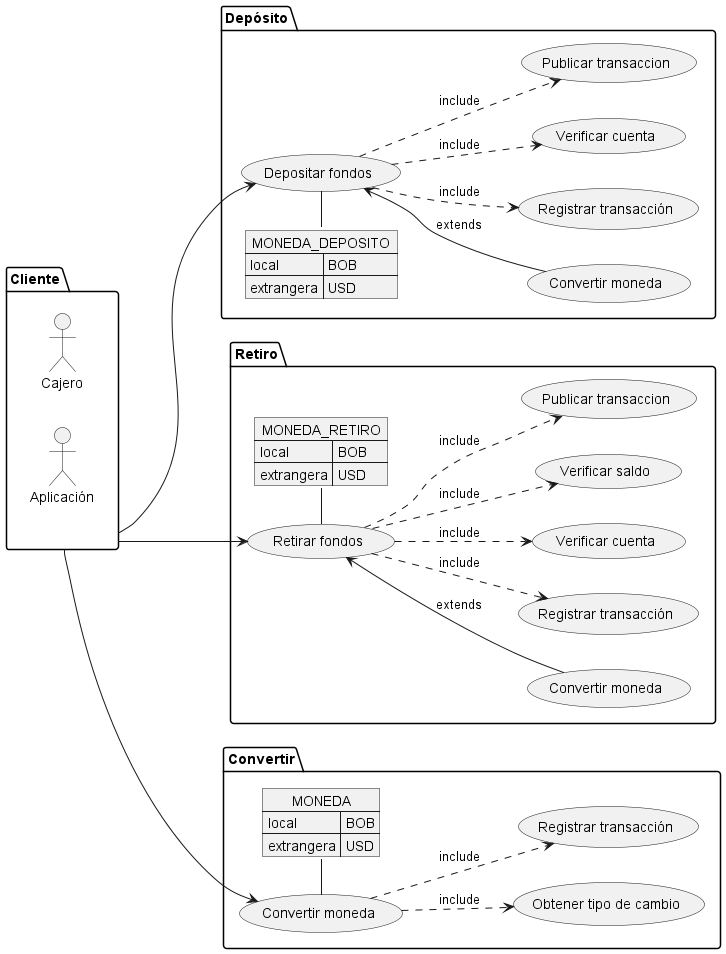
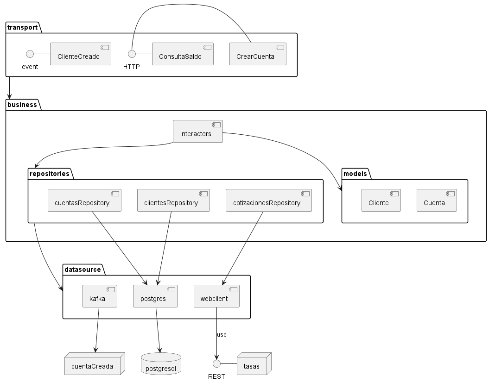
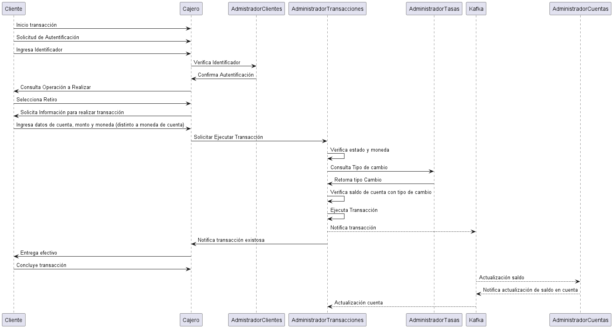

# Tabla de Contenidos

1. [Decisiones de Arquitectura](#decisiones)
2. [Atributos de Calidad](#atributos)
3. [Vision de Arquitectura](#vision)
4. [Escenarios](#escenarios)
5. [Modelo de Vistas de Arquitectura](#vistas)
    1. [Vista de casos de uso](#casoUso)
    2. [Vista Lógica](#logica)
    2. [Vista de Desarrollo](#desarrollo)
    3. [Vista de Proceso](#proceso)
    4. [Vista Física](#fisica)

## Decisiones de Arquitectura 

| Número | Título                                                 | Descripción                                                                                                                                                                                               |
|--------|:-------------------------------------------------------|:----------------------------------------------------------------------------------------------------------------------------------------------------------------------------------------------------------|
| D-001  | Estilo de Arquitectura                                 | La solución tomará como estilo el patrón SOA                                                                                                                                                              |
| D-002  | Infraestructura Base                                   | A nivel de infraestructura, se decidió apoyarse en contenedores, indistintamente de la plataforma                                                                                                         |
| D-003  | Patrón complementario - Microservicios                 | Se toma como patrón complementario microservicios, por que nos permite distribuir la funcionalidad en componentes independientes                                                                          |
| D-003  | Patrón complementario - Capas                          | Se toma como patrón complementario capas, con enfoque de arquitectura hexagonal para alinear la distribución de microservicios a dominios y encapsular la lógica de negocio en el nucleo de la aplicación |
| D-004  | Patrón complementario - Database per Service           | Para la capa de datos se propone una base de datos por microservicio, para componentes transaccionales se usara postgres y mongodb para información solo de registro                                      |
| D-005  | Patrón complementario - CQRS                           | Para un buen rendimiento en las consultas se propone CQRS, para que cada microservicio, sea responsable de mantener la información que necesita para realizar sus operaciones en vistas materializadas    |
| D-006  | Patrón complementario - Saga                           | Para la sincronización de las bases de datos de cada servicio, cada servicio actualiza la base de datos y publicará un evento mediante el broker de mensajeria kafka                                      |
| D-007  | Patrón complementario - Service instance per container | Para facilitar el proceso de escalamiento horizontal de los servicios con mayor carga se propone desplegar un servicio por contenedor                                                                     |
| D-008  | Uso de Api para cotizaciones                           | Se propone utilizar un servicio externo como https://currencylayer.com/ para obtener los tipos de cambio                                                                                                  |
| D-009  | Patrón complementario - Api Gateway                    | Se propone un único punto de acceso a la infraestructura para labores de balanceo de carga y seguridad.                                                                                                   |                                                                                                                                                                                                |
| D-010  | Patrón complementario - Brokered Authentication        | Apoyando el API Gateway, usando Brokered Authentication se garantizará una primera verificación de seguridad dentro de la infraestructura                                                                 |                                                                                                                                                                                                |

## Atributos de Calidad 

### Adecuación Funcional

#### Corrección Funcional

Por la naturaleza de las operaciones transaccionales que se llevarán a cabo dentro de la plataforma es necesario que el
sistema cumpla con las funciones para las que fue desarrollado.
Considerando un plan de conciliation de transacciones automático que garanticen el balance perfecto de las operaciones
realizadas.

### Eficiencia de desempeño

#### Tiempos de respuesta

La solución debe considerar que el tiempo de respuesta en consultas y consolidación de transacciones deben ser
superiores a los de la competencia.

### Fiabilidad

#### Disponibilidad

Con el fin de mantener un alto índice de disponibilidad del sistema se debera considerar en la implementación un proceso
de autoescalamiento de contenedores que presenten una carga superior en sus recursos por encima de 70%

#### Tolerancia a Fallos

Con el fin de garantizar la continuidad y consitencia de las transacciones la plataforma de contenedores debera contar
con mecanismos de balanceo de carga y conmutación por error

### Seguridad

#### Integridad

Para garantizar la integridad de las transacciones realizadas mediante la prevención de accesos o modificaciones no
autorizados a datos o programas de ordenador

#### No Repudio

Un servicio de utilidades de logging será el encargado de registrar todas las transacciones.
Los logs estarán protegidos a su vez por Exception Shielding, evitando mostrar información confidencial.

#### Autenticidad

Se debe garantizar que el 100% de las comunicaciones fuera de las fronteras del sistema sean mediante el protocolo
cifrado HTTPS.
Dentro del entorno del sistema (zona desmiitarizada) se usarán comunicaciones seguras en base a Trusted Subsystem.

### Mantenibilidad

#### Modularidad

La solución debe permitir que sea modificado de forma efectiva y eficiente para atender a necesidades de mejoras sin
introducir afectaciones a otros módulos

#### Analizabilidad

La solución debe facilitar la evaluación el impacto de un determinado cambio sobre el resto del los componentes,
diagnosticar las deficiencias o causas de fallos en el componente, o identificar las partes a modificar para nuevas
funcionalidades.

## Vision de Arquitectura 

Implementar una solución tecnológica orientada a la satisfacción de los clientes y el crecimiento de la cartera de
clientes ahorristas
basado en brindar transacciones de rápidas, integras y seguras a través del empoderamiento del area de TI

### Árbol de Utilidad (SMART - Specific - Measurable - Achievable – Real Time Constraint)

A = Alto, M = Medio, B = Bajo

| Atributo de Calidad     | Criterio                                                                        | Descripción                                                                                                                                                                                                        | Imp. | Dif. |
|-------------------------|:--------------------------------------------------------------------------------|:-------------------------------------------------------------------------------------------------------------------------------------------------------------------------------------------------------------------|------|------|
| Adecuación Funcional    | Corrección Funcional - Resultados correctos con el nivel de precisión requerido | Se debe garantizar la consistencia y la integridad de las transacciones realizadas                                                                                                                                 | A    | A    |
| Eficiencia de desempeño | Comportamiento temporal - Tiempos de ejecución de transacciones                 | Se debe garantizar la consistencia y la integridad de las transacciones en tiempo real                                                                                                                             | M    | A    |
| Fiabilidad              | Disponibilidad - Accesibilidad a los servicios                                  | Los servicios deben estar disponibles en todo momento                                                                                                                                                              | A    | A    |
| Fiabilidad              | Tolerancia a Fallos - Recuperación ante fallos de hardware y software           | En caso de presentarse alguna falla en el funcionamiento de debe contar con mecanismos de redundancia que permitan continuar con los servicios                                                                     | M    | B    |
| Seguridad               | Integridad                                                                      | Se debe garantizar la integridad de las transacciones realizadas asegurando que no se realicen accesos y modificaciones no autorizadas implementando las operaciones de consultas solo a Vistas Materializadas     | A    | A    |
| Seguridad               | No Repudio                                                                      | Se debe implementar un mecanismo de logging que permita demostrar las acciones o eventos que han tenido lugar, incluyendo en las peticiones las direcciones, dispositivos desde donde se realizaron las peticiones | M    | A    |
| Seguridad               | Autenticidad                                                                    | Todas las peticiones deben ser mediante protocolo HTTPS y contener un header de autentificación                                                                                                                    | A    | A    |
| Mantenibilidad          | Modularidad                                                                     | Se debe implementar de manera que un cambio en un componente tenga un impacto mínimo en los demás componentes                                                                                                      | B    | B    |
| Mantenibilidad          | Analizabilidad                                                                  | Se debe garantizar que la implementación permita diagnosticar las deficiencias o causas de fallos en el software o identificar las partes a modificar                                                              | M    | A    |                                                                                                                                                                                                |

## Escenarios 

| Escenario                  | Respuesta del Sistema                                                                                                                                                                                                                                                                     |
|----------------------------|-------------------------------------------------------------------------------------------------------------------------------------------------------------------------------------------------------------------------------------------------------------------------------------------|
| Justificación              | Al revisar los tiempos de la competencia se nota que es necesario implementar un sistema con tiempos de respuesta lo más cercano posible al tiempo real                                                                                                                                   |
| Atributos de Calidad       | Corrección funcional, Comportamiento temporal, Disponibilidad                                                                                                                                                                                                                             |
| Estímulos                  | Ejecución de transacciones y consulta de saldo                                                                                                                                                                                                                                            |
| Respuesta                  | Bajo condiciones de baja carga y carga normal la respuesta del sitio no debe sobrepasar los 2 segundos para consulta de saldo y los 5 segundos para transacciones. En caso de alta carga se permite la degradación del sistema respecto al tiempo de carga pero no al tiempo por petición |
| Decisiones de Arquitectura | Consultas de saldo sobre vistas materializadas y autoescalimiento de contenedores al presentarse consumo de recursos superior al 70%                                                                                                                                                      |
| Medición                   | Tiempo de respuestas en segundos                                                                                                                                                                                                                                                          |                                                                                                                                                                                            |

| Escenario                  | Usabilidad del Sistema                                                                                                                                                                                                                                                                                              |
|----------------------------|---------------------------------------------------------------------------------------------------------------------------------------------------------------------------------------------------------------------------------------------------------------------------------------------------------------------|
| Justificación              | Al estar en un entorno en el que se manejan transacciones financieras es necesario tener un robusto esquema de seguridad y respuestas claras frente a ataques de terceros. Además, es necesario que los ataques no generen sobrefacturación por aspectos como el autoescalamiento de la infraestructura.            |
| Atributos de Calidad       | Seguridad, Disponibilidad                                                                                                                                                                                                                                                                                           |
| Estímulos                  | Ataques programados de terceros                                                                                                                                                                                                                                                                                     |
| Respuesta                  | Las interacciones con los usuarios deben seguir un estricto protocolo de seguridad. Empezando con autenticación segura vía tokens y respaldada por una conexión HTTPS. A nivel de ataques, es necesario que estos sean detenidos tan pronto como sean detectados y con el menor impacto posible en la arquitectura. |
| Decisiones de Arquitectura | Utilizar un patrón tipo API Gateway de cara al exterior blinda en gran medida los accesos no autorizados a la arquitectura.                                                                                                                                                                                         |
| Medición                   | Cantidad de ataques detectados. Desempeño del sitio durante un ataque.                                                                                                                                                                                                                                              |                                                                                                                                                                                            |

| Escenario                  | Sincronización de Información                                                                                                                                                                                                                                                            |
|----------------------------|------------------------------------------------------------------------------------------------------------------------------------------------------------------------------------------------------------------------------------------------------------------------------------------|
| Justificación              | Al estar definido bajo un patron de base de datos por servicio es necesario considerar la sincronización de la información entre las diferentes bases de datos                                                                                                                           |
| Atributos de Calidad       | Corrección funcional, Comportamiento temporal, Disponibilidad                                                                                                                                                                                                                            |
| Estímulos                  | Necesidad de sincronización de información                                                                                                                                                                                                                                               |
| Respuesta                  | Información sincronizada entre las diferentes bases de datos                                                                                                                                                                                                                             |
| Decisiones de Arquitectura | Utilizar un patrón tipo CQRS para mantener vistas materializadas en los diferentes microservicios que mantengan su información actualizada a la subscripción de mensajes eventos de actualización mediante el broker de mensajeria kafka, permitirá mantener la información sincronizada |
| Medición                   | Cantidad de inconsistencias detectadas en procesos de conciliación                                                                                                                                                                                                                       |                                                                                                                                                                                            |

| Escenario                  | Verificación de Transacciones                                                                                                                                                                                         |
|----------------------------|-----------------------------------------------------------------------------------------------------------------------------------------------------------------------------------------------------------------------|
| Justificación              | Como un cajero automático tiene la finalidad de facilitar el proceso de retiro y deposito de manera inmediata es necesario considerar que el tiempo de respuesta de las transacciones manteniendo un balance perfecto |
| Atributos de Calidad       | Seguridad, Disponibilidad                                                                                                                                                                                             |
| Estímulos                  | Ejecución de transacciones                                                                                                                                                                                            |
| Respuesta                  | Resultado de la transacción                                                                                                                                                                                           |
| Decisiones de Arquitectura | Se decidió implementar el patron saga para mantener coherencia de los datos en los diferentes servicios sin utilizar transacciones distribuidas.                                                                      |
| Medición                   | Cantidad de inconsistencias detectadas en procesos de conciliación                                                                                                                                                    |                                                                                                                                                                                            |

| Escenario                  | Integración con terceros                                                                                                                                                                          |
|----------------------------|---------------------------------------------------------------------------------------------------------------------------------------------------------------------------------------------------|
| Justificación              | Dentro de las funcionalidades estipuladas, se espera que se puedan realizar depósitos y retiros en diferentes monedas (Local - BOB, USD - Extrangera) para incrementar el número de transacciones |
| Atributos de Calidad       | Corrección Funcional, Disponibilidad                                                                                                                                                              |
| Estímulos                  | Transacciones multimoneda                                                                                                                                                                         |
| Respuesta                  | Interacción con terceros                                                                                                                                                                          |
| Decisiones de Arquitectura | Se decidió implementar integración con https://currencylayer.com/ para obtener las tipos de cambios actualizados                                                                                  |
| Medición                   | % de transacciones en moneda local y % de transacciones en extrangera                                                                                                                             |                                                                                                                                                                                            |

## Modelo de Vistas de Arquitectura 

### Vista casos de uso 

#### Gestión de Cuentas 

_[Fuente PlantUML](../cuentas/src/main/resources/docs/plantUML/casos.puml)_

#### Gestión de Transacciones

_[Fuente PlantUML](../transacciones/src/main/resources/docs/plantUML/caso.puml)_

#### Gestión de Tasas de Cambio

_[Fuente PlantUML](../tasas/src/main/resources/docs/plantUML/caso.puml)_

### Vista Lógica 

#### Tasas

#### Clientes

#### Cuentas

#### Transacciones

### Vista de Desarrollo 

#### Cuentas

_[Fuente PlantUML](../cuentas/src/main/resources/docs/plantUML/componentes.puml)_

### Vista de Proceso 

#### Transaccion - Caso Ideal

_[Fuente PlantUML](../transacciones/src/main/resources/docs/plantUML/secuenciaTransferenciaExitosa.puml)_

### Vista Física 

